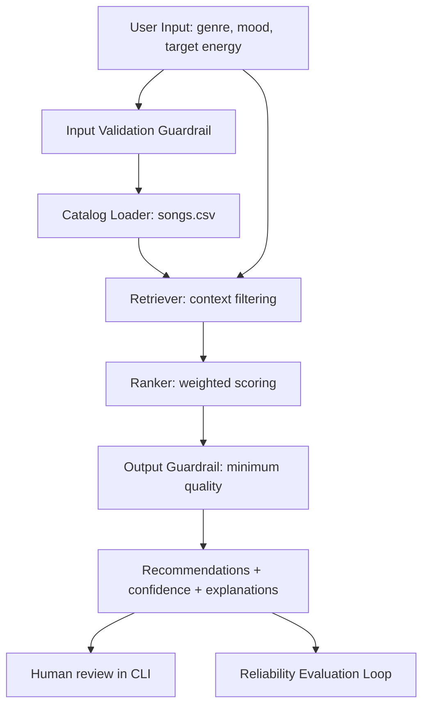

# Applied AI System Project 4: Retrieval-Aware Music Recommender

## Original Project (Modules 1-3)
This project extends `ai110-module3show-musicrecommendersimulation-starter`, a small classroom recommender that ranked songs using simple feature matching.  
The original goal was to simulate how recommendation systems use user preferences (genre, mood, energy) to score a tiny catalog and return top songs.  
It demonstrated basic recommendation logic, but did not include retrieval context control, reliability guardrails, or integrated evaluation.

Reference starter repository: [codepath/ai110-module3show-musicrecommendersimulation-starter](https://github.com/codepath/ai110-module3show-musicrecommendersimulation-starter.git)

## Title and Summary
The system recommends songs from a CSV catalog using a retrieval-augmented ranking pipeline.  
It first retrieves context-relevant songs (RAG-style retrieval) and then ranks them with a weighted scoring model.  
To improve trust and reproducibility, the system includes input validation, output guardrails, logging, automated tests, and an evaluation loop with pass-rate reporting.

## Architecture Overview

Main components:
- CLI entrypoint (`src/main.py`)
- Retriever (`src/retrieval.py`) - the substantial new AI feature
- Ranker (`src/recommender.py`)
- Guardrails (`src/reliability.py`)
- Evaluator (`src/evaluate.py`)
- Tests (`tests/test_system.py`)

## Setup Instructions
1. Clone this repository and open the project folder.
2. (Optional) create and activate a virtual environment:
   - Windows: `.venv\Scripts\activate`
   - Mac/Linux: `source .venv/bin/activate`
3. Install dependencies:
   - `pip install -r requirements.txt`
4. Run the system:
   - `python -m src.main`
5. Run tests:
   - `pytest`
6. Run reliability summary:
   - `python -c "from src.evaluate import run_reliability_check; print(run_reliability_check())"`
7. Run detailed test harness report:
   - `python -m src.evaluate`

## Sample Interactions

### Example 1
Input:
- genre: `electronic`
- mood: `focused`
- target_energy: `0.8`

Output (sample):
- `Skyline Run` - confidence `0.95` - "genre match, mood match, energy gap 0.02, tempo in range"
- `Second Sun` - confidence `0.86` - "genre match, energy gap 0.06, tempo in range"

### Example 2
Input:
- genre: `jazz`
- mood: `calm`
- target_energy: `0.3`

Output (sample):
- `Quiet Lantern` - confidence `0.51` - "mood match, energy gap 0.08, tempo in range"

### Example 3 (guardrail behavior)
Input:
- genre: `metal`
- mood: `focused`
- target_energy: `0.7`

Output:
- Validation error: "Unsupported genre 'metal'. Allowed: [...]"

## Design Decisions and Trade-offs
- Added a retrieval step before ranking so recommendations use a focused context window, not the full catalog every time.
- Kept scoring transparent and deterministic for easy debugging and classroom interpretability.
- Used simple guardrails (input constraints + minimum output score) to reduce obvious failure cases.
- Trade-off: transparency is strong, but recommendation quality is limited by hand-crafted weights and small dataset size.

## Reliability and Testing Summary
- Reliability mechanisms included:
  - Input validation (`validate_request`)
  - Output quality guardrail (`enforce_output_guardrail`)
  - Confidence score per recommendation
  - Logging across load/retrieval stages
  - Automated tests in `tests/test_system.py`
  - Evaluation loop in `src/evaluate.py`
- Example evaluation summary format:
  - `"5 out of 6 checks passed; average confidence = 0.82"`
  - Detailed harness compares retrieval-aware vs baseline results with pass-rate delta.

## Reflection: AI Collaboration, Ethics, and Learning
- Limitations and biases:
  - Small catalog over-represents a few genres and mood labels.
  - Hand-tuned weights can bias toward high-energy songs if not carefully balanced.
  - Confidence is model-internal and not a guarantee of real user satisfaction.
- Misuse risks and mitigations:
  - Misuse: users could treat this as objective taste prediction.
  - Mitigation: explicit messaging that this is a simulation, plus transparent explanations and confidence values.
- Reliability surprise:
  - Retrieval improved relevance for focused profiles but reduced diversity in some cases.
- AI collaboration:
  - Helpful AI suggestion: introducing retrieval-before-ranking improved consistency and made the architecture clearly "Applied AI" instead of only rule-based ranking.
  - Flawed AI suggestion: an early idea to aggressively filter by exact genre+mood removed too many songs; relaxing retrieval conditions fixed sparse-context failures.

## Future Improvements
- Add diversity-aware re-ranking so top results are not too similar.
- Learn weights from user feedback instead of hand tuning.
- Expand catalog and include richer features (lyrics themes, region/language, recency).
